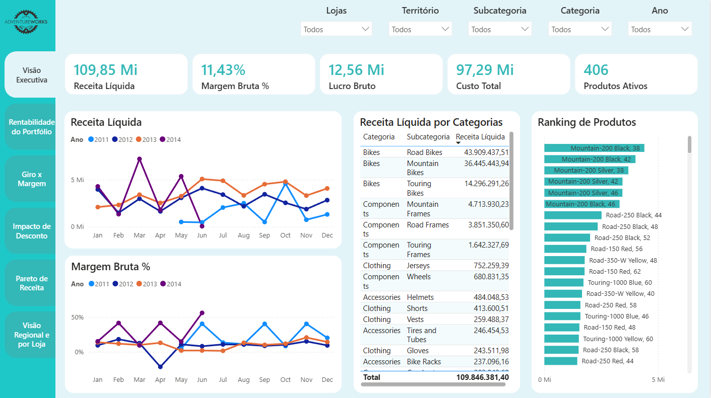
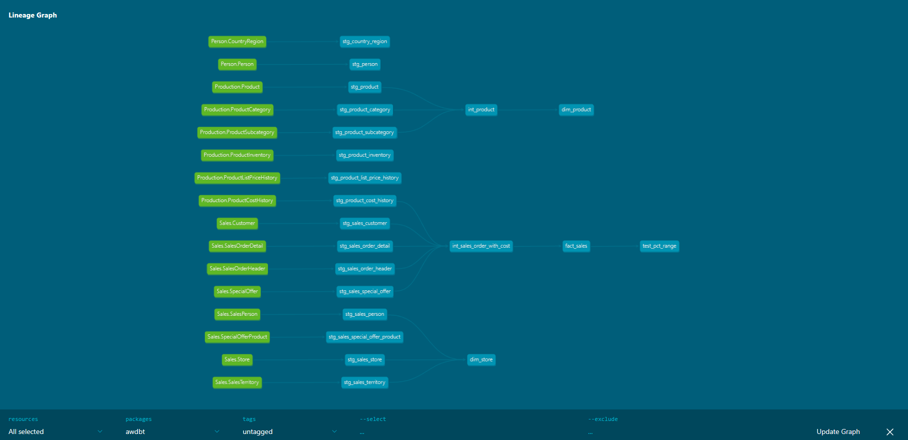
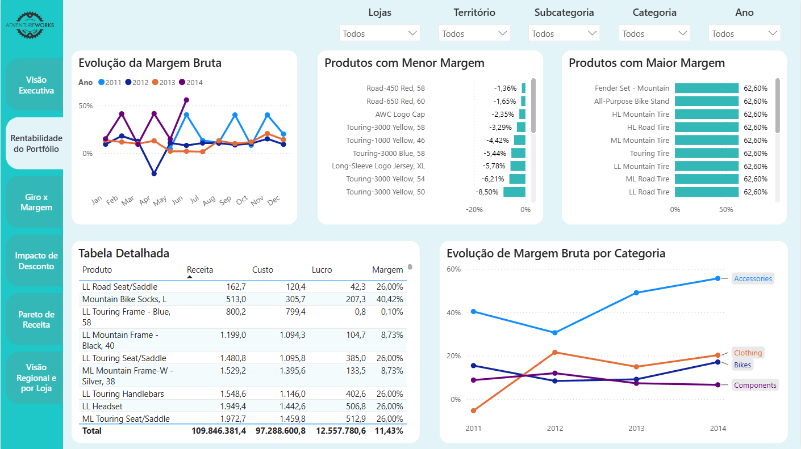
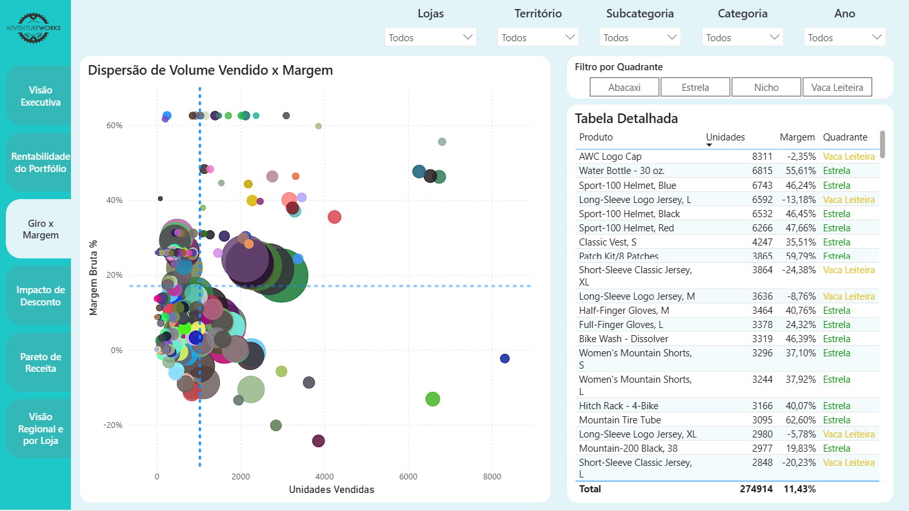
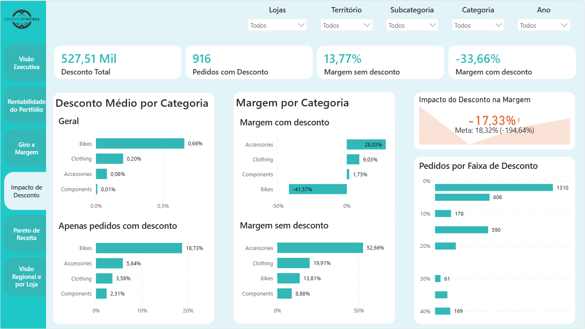
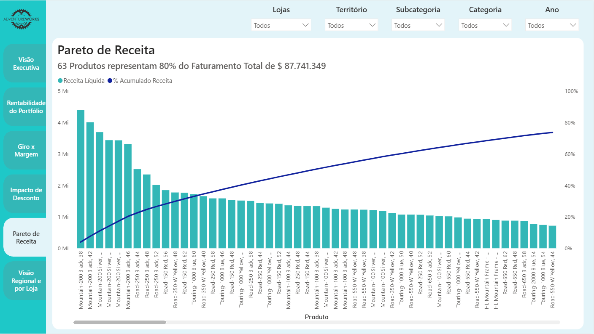
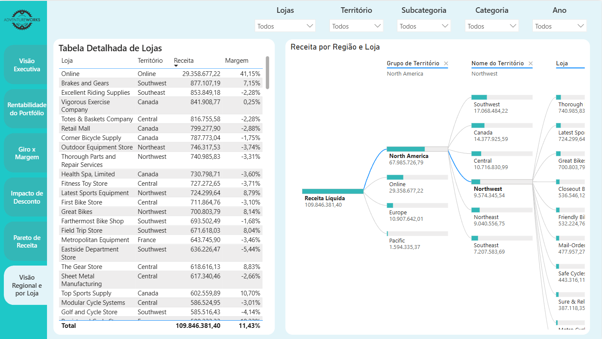

# AdventureWorks Product Portfolio Analytics

> Pipeline completo de engenharia analítica sobre o dataset AdventureWorks da Microsoft — da ingestão bruta até o dashboard executivo de portfólio de produtos.



---

## Sumário

- [Visão Geral](#visão-geral)
- [Stack](#stack)
- [Arquitetura](#arquitetura)
- [Modelagem dbt](#modelagem-dbt)
- [Dashboard](#dashboard)
- [Como Executar](#como-executar)
- [Testes](#testes)
- [Decisões de Design](#decisões-de-design)

---

## Visão Geral

Este projeto simula um ambiente analítico empresarial real: um banco operacional legado sendo replicado para uma camada analítica, transformado e entregue em dashboard executivo.

**Perguntas de negócio respondidas:**
- Quais produtos têm margem real versus apenas volume?
- Onde estamos na matriz Giro x Margem (Estrela, Vaca Leiteira, Nicho, Abacaxi)?
- Quanto os descontos estão destruindo a rentabilidade?
- Quais produtos representam 80% da receita?
- Como a performance se distribui por região e loja?

**Período dos dados:** junho/2011 a julho/2014  
**Volume:** 121.317 linhas de pedido | 266 produtos | 701 lojas | 10 territórios

---

## Stack

| Camada | Tecnologia |
|--------|-----------|
| Fonte | SQL Server 2022 (Docker) — AdventureWorks OLTP |
| Ingestão | Airbyte (abctl / Kubernetes local) |
| Armazenamento | PostgreSQL 16 (Docker) |
| Transformação | dbt 1.8 (Docker) |
| Visualização | Power BI Desktop |

```
SQL Server (Docker)
    → Airbyte
        → PostgreSQL (Docker)
            → dbt
                → Power BI
```

---

## Arquitetura

### Fonte de Dados

**AdventureWorks 2022 OLTP** — banco operacional normalizado da Microsoft. Escolhido intencionalmente em vez do RetailDW (que já vem como star schema) para que a transformação no dbt seja real e demonstrável.

Download oficial:
> https://github.com/microsoft/sql-server-samples/releases

O arquivo `.bak` é restaurado automaticamente via `entrypoint.sh` quando o container SQL Server sobe.

### Ingestão com Airbyte

O Airbyte conecta ao SQL Server como source e replica os schemas `Sales`, `Production` e `Person` para o PostgreSQL como destination, sem transformação — dado chega cru.

- **Sync mode:** Full Refresh | Overwrite
- **Schedule:** Manual (dado estático)
- **Namespace:** Source-defined (preserva schemas originais)

---

## Modelagem dbt

### Lineage




O lineage mostra a cadeia completa de dependências: cada source (verde) alimenta os models de staging (azul), que alimentam os intermediates, que alimentam os marts finais usados pelo Power BI.

### Estrutura de Camadas

```
models/
├── staging/          # 16 models — padronização e limpeza
├── intermediate/     # 2 models — joins e lógica de negócio
└── marts/            # 3 models — fatos e dimensões
```

#### Staging
Cada model de staging lê de um `source()` declarado no `sources.yml` e entrega:
- Nomes de colunas em `snake_case`
- Remoção de colunas desnecessárias (`rowguid`, metadados Airbyte)
- Sem transformação de lógica de negócio

#### Intermediate

**`int_product`**  
Join entre `stg_product`, `stg_product_subcategory` e `stg_product_category`. Entrega o produto com hierarquia completa (categoria → subcategoria → produto) num único model.

**`int_sales_order_with_cost`**  
Join mais complexo do projeto. Une linhas de pedido com custo histórico correto:

```sql
left join stg_product_cost_history as pch
    on sod.product_id = pch.product_id
    and soh.order_date >= pch.start_date
    and soh.order_date <= coalesce(pch.end_date, '9999-12-31'::date)
```

`ProductCostHistory` segue padrão **SCD Type 2** — cada mudança de custo gera uma nova linha. O join por período de vigência garante que o custo correto seja usado para cada venda. Produtos sem custo vigente usam o último custo conhecido via `DISTINCT ON`.

Também inclui join com `SpecialOffer` para trazer desconto aplicado, e com `Customer` para trazer `store_id`.

#### Marts

**`fact_sales`** — Granularidade: uma linha por item de pedido (SalesOrderDetail)

| Coluna | Descrição |
|--------|-----------|
| `product_id` | FK → dim_product |
| `store_id` | FK → dim_store |
| `order_date` | FK → dim_date |
| `net_revenue` | `unit_price × qty × (1 - discount)` |
| `total_cost` | `standard_cost × qty` |
| `profit` | `net_revenue - total_cost` |
| `gross_margin_pct` | `profit / net_revenue` |

**`dim_product`** — 504 produtos com hierarquia completa

**`dim_store`** — 701 lojas físicas + 1 linha "Online" (via `UNION ALL`)

> Pedidos online não têm `store_id` no AdventureWorks. A solução foi adicionar uma linha "Online" na `dim_store` e usar `COALESCE(store_id, -1)` na `fact_sales`.

### Macro

```sql

    {{ unit_price }} * {{ order_quantity }} * (1 - {{ unit_price_discount }})

```

Evita repetição do cálculo de receita líquida nos 3 lugares onde é necessário na `fact_sales`.

---

## Dashboard

### Página 1 — Visão Executiva


KPIs gerais, evolução de receita por mês comparando anos, tabela de receita por categoria/subcategoria e ranking de produtos.

---

### Página 2 — Rentabilidade do Portfólio




Evolução da margem bruta ao longo do tempo, produtos com maior e menor margem, tabela detalhada com receita/custo/lucro/margem por produto, e evolução de margem por categoria.

---

### Página 3 — Giro x Margem




Scatter plot posicionando cada produto em um dos 4 quadrantes. As linhas de referência são a média de unidades vendidas (eixo X) e a média de margem bruta % (eixo Y).

| Quadrante | Volume | Margem |
|-----------|--------|--------|
| ⭐ Estrela | Alto | Alta |
| 🐄 Vaca Leiteira | Alto | Baixa |
| 💎 Nicho | Baixo | Alta |
| ⚠️ Abacaxi | Baixo | Baixa |

A classificação por quadrante também aparece na tabela lateral, com filtro interativo por tipo.

---

### Página 4 — Impacto de Desconto




**Principal insight:** Bikes vendidas com desconto têm margem média de **-41,57%**. Os descontos de 30-40% (367 pedidos) corroem completamente a margem da categoria.

Visuais: desconto médio por categoria (geral vs apenas pedidos com desconto), margem com e sem desconto por categoria, distribuição de pedidos por faixa de desconto.

---

### Página 5 — Pareto de Receita




**63 de 266 produtos (23,7%) representam 80% da receita total de R$87,7 milhões.**

Curva de Pareto com subtítulo dinâmico calculado em DAX — o número atualiza conforme os filtros são aplicados.

---

### Página 6 — Visão Regional e por Loja




Decomposition Tree interativo com hierarquia Grupo Regional → Território → Loja, e tabela completa de lojas com receita e margem.

**Destaques:**
- Canal Online: maior margem do portfólio (41,15%) com R$29,3 mi em receita
- North America concentra 67,9 mi (61,9% da receita total)

---

## Como Executar

### Pré-requisitos
- Docker Desktop instalado e rodando
- Airbyte via `abctl` configurado
- Power BI Desktop
- 8GB+ RAM disponível

### 1. Clonar o repositório
```bash
git clone https://github.com/rodriguesgui/adventureworks_product_analytics.git
cd adventureworks_product_analytics
```

### 2. Baixar o dataset
Baixe `AdventureWorks2022.bak` em:
> https://github.com/microsoft/sql-server-samples/releases

Coloque em `data/AdventureWorks2022.bak`.

### 3. Configurar variáveis de ambiente
```bash
cp .env.example .env
```

```env
MSSQL_SA_PASSWORD=Admin@1234
POSTGRES_USER=postgres
POSTGRES_PASSWORD=postgres
POSTGRES_DB=adventureworks_raw
```

### 4. Subir os containers
```bash
docker-compose up --build -d
```

Aguarde ~30s e verifique o restore:
```bash
docker logs aw_sqlserver
# Esperado: "RESTORE DATABASE successfully processed..."
```

### 5. Configurar o Airbyte
Acesse `http://localhost:8000` e configure:

**Source — SQL Server:**
- Host: `host.docker.internal`
- Port: `1444`
- Database: `AdventureWorks2022`
- Schemas: `Sales`, `Production`, `Person`
- User: `sa` | Password: conforme `.env`

**Destination — PostgreSQL:**
- Host: `host.docker.internal`
- Port: `5444`
- Database: `adventureworks_raw`
- Schema: `public`
- User: `postgres` | Password: conforme `.env`

Execute a sincronização (Full Refresh | Overwrite | Manual).

### 6. Executar o dbt
```bash
docker exec -it aw_dbt bash
dbt run
dbt test
```

Resultado esperado:
```
Done. PASS=21 WARN=0 ERROR=0 SKIP=0 TOTAL=21
Done. PASS=102 WARN=0 ERROR=0 SKIP=0 TOTAL=102
```

### 7. Conectar o Power BI
- **Obter dados** → PostgreSQL
- Servidor: `localhost:5444`
- Banco: `adventureworks_raw`
- Importar: `public_marts.fact_sales`, `public_marts.dim_product`, `public_marts.dim_store`

---

## Testes

| Camada | Testes | Status |
|--------|--------|--------|
| Staging | 56 | ✅ |
| Intermediate | 20 | ✅ |
| Marts | 26 | ✅ |
| Singular (`test_pct_range`) | 1 | ✅ |
| **Total** | **103** | **✅ 103/103** |

**Tipos de testes:**
- `not_null` e `unique` nas PKs de todas as tabelas
- `relationships` entre dimensões e staging
- Teste singular: `gross_margin_pct` não pode ser > 1 (>100%) e `unit_price_discount` deve estar entre 0 e 1

---

## Decisões de Design

**Por que AdventureWorks OLTP e não o RetailDW?**  
O RetailDW já vem modelado como star schema — não há trabalho real de transformação. O OLTP normalizado permite demonstrar a cadeia staging → intermediate → marts com problemas reais, como o join SCD Type 2 no custo histórico.

**Por que Airbyte?**  
O padrão SQL Server → Airbyte → PostgreSQL replica exatamente o que acontece em empresas com sistemas legados. É um diferencial de portfólio defensável em entrevista — mostra conhecimento de ingestão, não só de transformação.

**Por que calcular margem no dbt e não no Power BI?**  
Métricas calculadas na camada de transformação garantem consistência — qualquer ferramenta que consumir os dados terá o mesmo número. Cálculo no Power BI fica preso na ferramenta e dificulta validação.

**Por que o fallback de custo com DISTINCT ON?**  
64 linhas de pedido tinham `OrderDate` fora de qualquer período de vigência em `ProductCostHistory`. Em vez de deixar `standard_cost = NULL` (que quebraria todos os cálculos de margem), o intermediate busca o último custo registrado do produto como fallback.

---

## Autor

**Guilherme Rodrigues**  
Analista de Dados | Power BI · SQL · dbt · Python  
[github.com/rodriguesgui](https://github.com/rodriguesgui)

